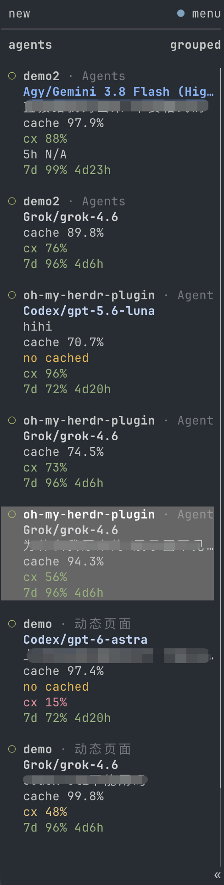
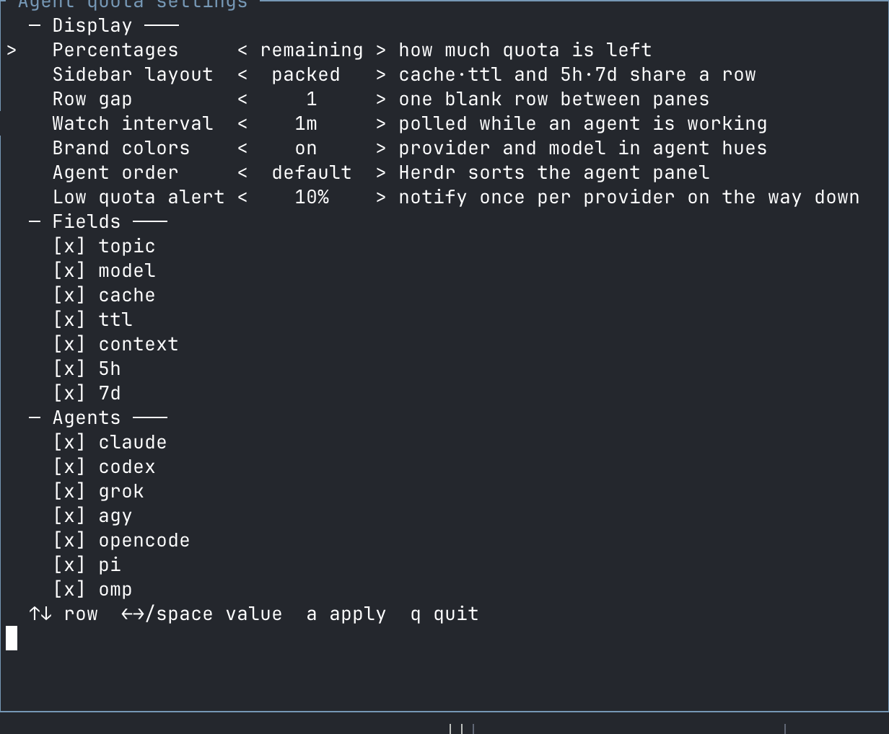

# herdr-agent-quota (OCX hub remaining)

Model, context, prompt-cache usage, and subscription quota in Herdr's Agent sidebar.
This tree is the [upstream plugin](https://github.com/levi-qiao/herdr-agent-quota)
plus remaining 5h/7d for omp panes that talk to a remote OpenCodex hub.

[](LICENSE)

[简体中文](README.zh-CN.md)

<table>
<tr><th>gauges (default)</th><th>narrow</th></tr>
<tr>
<td valign="top"></td>
<td valign="top"></td>
</tr>
</table>

The plugin preserves Herdr's native machine/workspace/tab row, custom styles,
and worktree grouping. The branded provider/model line is the agent identity;
the native `agent` row is omitted so `grok` does not sit above `Grok/grok-4.6`.
Optional quota ordering and low-quota notifications are disabled by default.
Empty fields collapse; percentages can show remaining or used quota.
The default layout is `gauges`: a meter beside each quota number. Bars fill
to the printed number, and `cx`, `5h`, `7d`, and `30d` all follow
`quota-percent`. Labels are three characters so those periods align; a
provider-named window too long for that column keeps a plain row instead of
a truncated bar. Cache and TTL share a line when they fit, and split again
when the sidebar is too narrow. Meters size to the connected Herdr
endpoint's sidebar — indent and scrollbar included — and drop on a narrow
width rather than clip. A resize takes effect on the next refresh or pane
event (`prefix+shift+r`). Under `gauges` the `cx` row takes a severity
colour of its own, on the same muted green/amber/red scale as `5h` and
`7d`: colour always reads the headroom left — amber below 50% of the
context left, red below 20%. Switch layout, fields, and percentages from
the settings pane.

## Install and upgrade

Requires **Herdr 0.9.0+**, the Rust toolchain pinned in `rust-toolchain.toml`,
macOS or Linux, and a supported agent CLI.

```sh
herdr plugin install nordz0r/herdr-opencodex/herdr-agent-quota --yes
herdr plugin list
```

Local checkout:

```sh
git clone https://github.com/nordz0r/herdr-opencodex.git
cd herdr-opencodex/herdr-agent-quota
./install.sh
```

Upgrades retain saved preferences, repair managed configuration, refresh quota,
and restore background updates automatically. No cache deletion or watcher
management is required. Changes to the Herdr server connection are adopted by
the watcher automatically.

## Settings

Press `prefix+shift+q`, or run the following if that key is already assigned:

```sh
herdr plugin pane open --plugin nordz0r.agent-quota --entrypoint settings --focus
```



| Setting | Options |
| --- | --- |
| Percentages | Remaining or used; colors always indicate remaining headroom |
| Layout | `gauges` (default) adds a meter beside each quota number; `packed` groups related fields; `stacked` gives each field a row |
| Row gap | Zero or one blank line between agents |
| Watch interval | 30 seconds–1 hour; default 60 seconds |
| Fields | Provider, topic, model, cache, TTL, context, short/long quota |
| Brand colors | On or off |
| Agent order | Herdr default or lowest remaining quota first |
| Low quota alert | Off or a threshold from 1% to 100% |
| Agents | Claude, Codex, Grok, Agy, OpenCode, Pi, OMP, Devin |

Use arrows or Space to edit, `a` to apply, and `q` to close.
Installer options are also available through `./install.sh --help`.

## Data sources and limits

| Agent | Quota source | Attribution |
| --- | --- | --- |
| Codex | Codex app-server; 5h and/or 7d | Current login in the plugin's `CODEX_HOME` |
| Grok | CLI billing endpoint; 7d or 30d | Current CLI credentials |
| Devin | CLI usage endpoint; 1d and 7d | Current CLI credentials |
| Claude Code | StatusLine; 5h and 7d | Exact session observation |
| Agy / Antigravity | StatusLine; 5h and 7d | Exact session and identifiable model pool |
| OpenCode | OpenCode Go usage endpoint | Go credential; confirmed PAYG routes have no subscription quota |
| Pi | Canonical Codex quota | Only when the recorded account matches |
| OMP (OAuth) | `omp usage --json --provider <id>` | Reported account matching the session's credential pin |
| OMP on OpenCodex hub | management `GET /api/provider-quotas` | Hub remaining when `omp usage` is empty for an `ocx` API key |

Quota windows retain their provider's meaning. Model, context, and cache data
come from the identified session when available. `ttl≈` marks an estimated
prompt-cache lifetime, not a guaranteed expiry. Topic extraction uses only the
named pane's visible screen and preserves the last topic when it scrolls away.

All supported working agents participate in one background watcher. Requests
are debounced for 60 seconds, including a final refresh after a turn settles.
OMP additionally retains its own five-minute usage cache. Idle panes sharing a
verified quota source receive the same reading.

Native Codex, Grok, and Devin collectors follow the plugin's current login,
not separate accounts for each pane. Claude/Agy do not report a reliable serving
account ID, so their observations are not shared across sessions. Unknown
identity or model-pool attribution does not produce a guessed quota. Failed
requests preserve the last verified reading for that same account; they do not
turn failures into zero usage.

## OpenCodex hub remaining

`omp usage` is empty for an OCX API key. Remaining 5h/7d lives on the hub
management API, not on data-plane `/v1/usage` (spend only).

```sh
CFG="$(herdr plugin config-dir nordz0r.agent-quota)"
printf '%s\n' 'https://ocx.goldfinches.ru' > "$CFG/ocx-hub-url"
printf '%s\n' "$HOME/.opencodex/hub-admin-api-token" > "$CFG/ocx-hub-admin-token-file"
chmod 600 "$HOME/.opencodex/hub-admin-api-token"
herdr plugin action invoke nordz0r.agent-quota.refresh
```

The token must be the hub **admin** credential (`OPENCODEX_ADMIN_AUTH_TOKEN`).
A data-plane `ocx_data_*` key gets 401. Never commit or print it.

Pane models map to hub reports: `grok*` → `xai` (weekly only), `gpt*`/`codex`
→ `openai` (5h+7d), `glm`/`zai` → `zai`, `gemini*` → `google-antigravity`
(`customWindows` Gem / Gem Weekly). Cache keys are `ocx/{family}` so those
panes do not share one snapshot.

## Troubleshooting

| Symptom | Check |
| --- | --- |
| Session data is missing | Run `herdr integration status`; load missing integrations before restarting the affected agent |
| Claude/Agy quota is missing | Send a turn so the session's StatusLine produces an observation |
| OMP quota is missing | Check `omp usage --json --redact --provider <id>` |
| OMP OCX remaining is `N/A` | Put a hub **admin** token in `~/.opencodex/hub-admin-api-token` (mode 0600) and `ocx-hub-url` / `ocx-hub-admin-token-file` under `herdr plugin config-dir nordz0r.agent-quota`. A data-plane `ocx_data_*` key cannot read remaining. |
| Devin quota is missing | Check the CLI login and `DEVIN_CREDENTIALS_FILE` if customized |
| Rows are missing | Run the configure action below to repair managed configuration |
| The `gauges` meter disappears on a narrow sidebar | Expected below ~24 columns; widen the sidebar and refresh |
| `gauges` still uses the old width after a resize | Refresh with `prefix+shift+r`; there is no live resize publish path |
| Cache and TTL stay on two lines under `gauges` | Widen the sidebar until `cache … · ttl≈…` fits |

```sh
herdr plugin action invoke refresh --plugin nordz0r.agent-quota
herdr plugin action invoke configure --plugin nordz0r.agent-quota
```

Uninstall everything with `./uninstall.sh`, or remove a subset with
`./uninstall.sh --agent grok`. Configuration changes are reversible; user-owned
settings and other agents remain intact.

## Contributing

See [CONTRIBUTING.md](CONTRIBUTING.md) for development and validation,
[SECURITY.md](SECURITY.md) for data handling and vulnerability reports, and
[CHANGELOG.md](CHANGELOG.md) for release notes. Dated investigations are indexed
in [docs/README.md](docs/README.md).

## License

[MIT](LICENSE). Based on [levi-qiao/herdr-agent-quota](https://github.com/levi-qiao/herdr-agent-quota). Not affiliated with Herdr or the supported AI providers.
